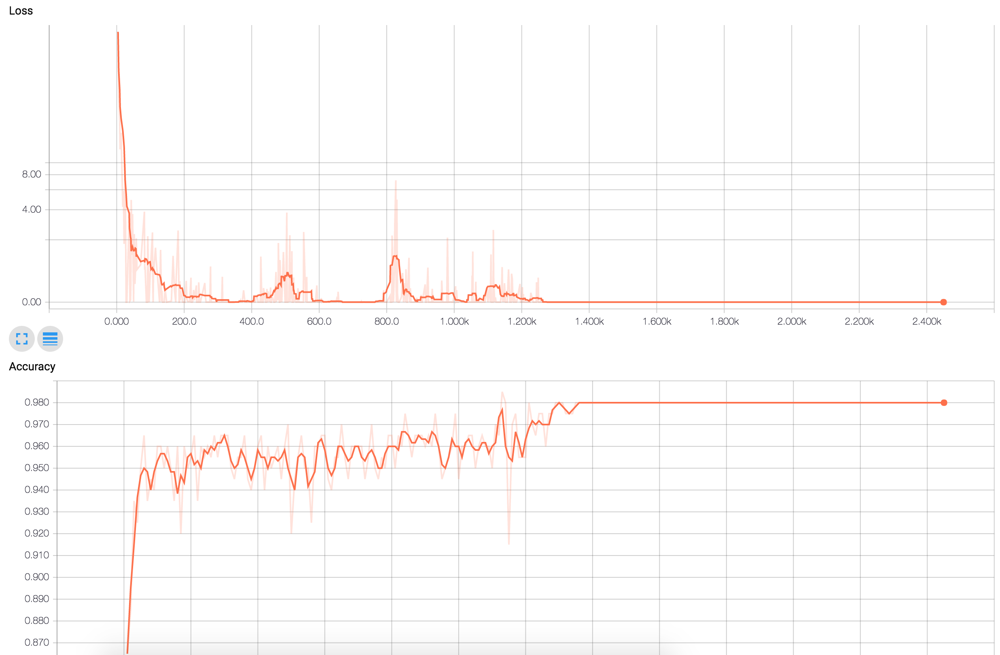

# Hive

Hi(ve)!

This repo is the result of some work done in the Startup Weekend AI in Paris.

It contains two models:
- The first one is a very simple model based on CNN up-to-date best practice, reaching 98% percent accuracy
- The second one is a fine-tuned model fron vgg-19 which took too long to be retrained (no kidding...)

*DISCLAIMER*
This repo does not contains the trainings/dev/test sets due to proprietary concerns.

## Take aways
- The simple model which take 3MB of memories and 6ms (on titan X) to compute an image is god damn accurate! 

Completely blowing up previous bees larvae detections i know of using OpenCV, and this was achieved thanks to only 2000 training samples which is a very small dataset.

This continue to validate the fact that deep learning is very well suited to handle real life variance.

- The second model is not really useful for bees larvae detection, yet it shows how it is easy to fine-tune a model using TensorFlow (The VGG-19 model was taken from this [site](https://www.cs.toronto.edu/~frossard/post/vgg16/)).

- The training phase is interesting in terms of overfitting:


We can see that we reach 0 percent error which means we completely overfit the data, yet the generalization on the dev set keeps improving.

This is a clear indicator that more data would improve even more the accuracy of the simple model. Also we probably can simplify it even further.

## Usage
- Run the `./vgg/download.sh` script to download pretrained vgg weights
- Run `python vgg/vgg.py` to use a proper Saver to save the graph and weights (You can run `python vgg/tf-vgg.py` to check that results are the same)
- Finally you can check the file `models/bee.py` to see how i add my personnal classifier on top of the CNN and run `python train.py --model complex` to train it

- If you want to train the simple model, jsut use `python train.py`

## Installation
```bash
virtualenv env -p python3.5
source env/bin/activate
pip install -r requirements.txt
# To install TensorFlow: https://www.tensorflow.org/versions/r0.11/get_started/index.html
```

## Running the models
You can test both models by running `python test.py` script.

And finally you can even export a frozen model using `python freeze.py`. if you want to use it in production with TensorFlow in a more convenient way.

# Licence
MIT 

(Check the LICENCE file)

